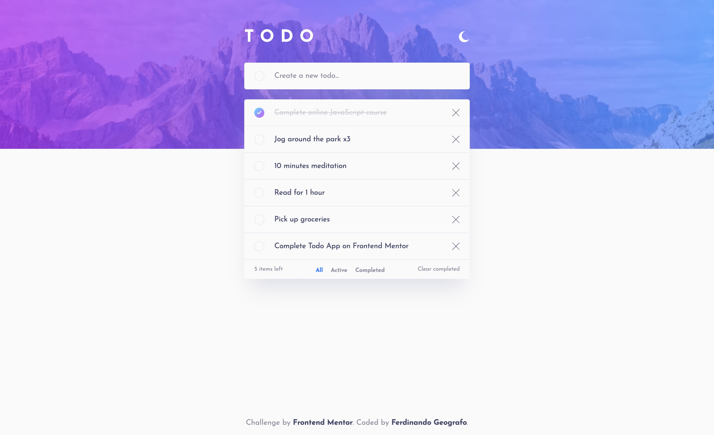

# Frontend Mentor - Todo app solution

This is a solution to the [Todo app challenge on Frontend Mentor](https://www.frontendmentor.io/challenges/todo-app-Su1_KokOW). Frontend Mentor challenges help you improve your coding skills by building realistic projects.

## Table of contents

- [Overview](#overview)
  - [The challenge](#the-challenge)
  - [Screenshot](#screenshot)
  - [Links](#links)
- [My process](#my-process)
  - [Built with](#built-with)
  - [What I learned](#what-i-learned)
  - [Continued development](#continued-development)
  - [Useful resources](#useful-resources)
- [Author](#author)

## Overview

### The challenge

Users should be able to:

- View the optimal layout for the app depending on their device's screen size
- See hover states for all interactive elements on the page
- Add new todos to the list
- Mark todos as complete
- Delete todos from the list
- Filter by all/active/complete todos
- Clear all completed todos
- Toggle light and dark mode
- **Bonus**: Drag and drop to reorder items on the list

### Screenshot

### Links

- Solution URL: [https://github.com/FerdinandoGeografo/todo-app-fg](https://github.com/FerdinandoGeografo/todo-app-fg)
- Live Site URL: [https://todo-app-fg.netlify.app/](https://todo-app-fg.netlify.app/)

## My process

### Built with

- HTML 5
- CSS & Flexbox
- [Angular v.17](https://angular.dev/)
- [RxJS](https://rxjs.dev/)

### What I learned

In this challenge I wanted to approach the new version of Angular for the first time using the brand new features offered such as control flow, stable signal management and much more. I also wanted to try a different pattern compared to previous versions where I used both Observables for CRUD operations (which in the future can call real APIs of a backend rather than managing data from localStorage), and Signals for managing internal state .

### Continued development

Having the aim of practicing with the new version of Angular, for the moment I did not want to realize the bonus points of the challenge such as drag and drop and management of the application as a full-stack-application, however they will be points that I will delve into later.

### Useful resources

- [Angular Beta Docs](https://angular.dev/)

## Author

- LinkedIn - [@FerdinandoGeografo](https://www.linkedin.com/in/ferdinandogeografo/)
- GitHub - [@FerdinandoGeografo](https://github.com/FerdinandoGeografo/job-listings-with-filtering)
- Frontend Mentor - [@FerdinandoGeografo](https://www.frontendmentor.io/profile/FerdinandoGeografo)
